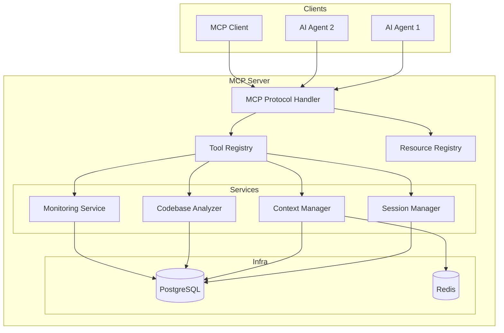
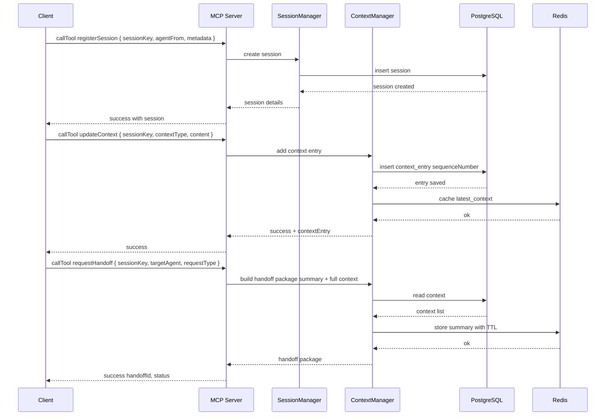
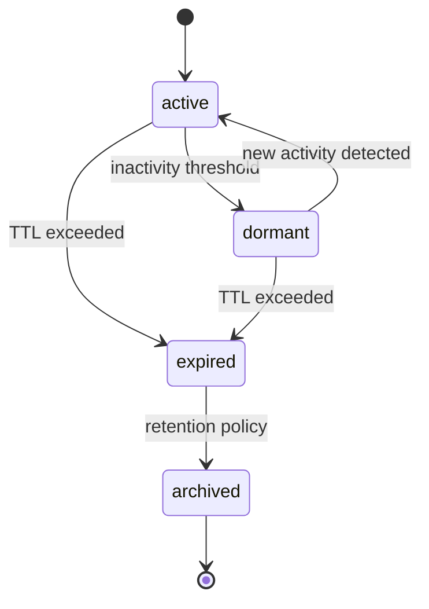

# Core Concepts

This document explains the architecture, components, data flow, and key terminology of the AI Handoff MCP Server. Diagrams use Mermaid for portability.

Terminology
- Session: A logical container identified by sessionKey that groups context entries and handoff requests across agents
- Context Entry: A sequenced item of data text, file ref, tool_call, system associated with a session
- Handoff: A request to transfer session context to a target agent with an explicit handoff type
- MCP Tool: A callable function exposed by the MCP server to clients registerSession, updateContext, requestHandoff, etc.
- MCP Resource: A read-only endpoint exposed via a URI handoff://... for discovery and retrieval
- Persistence Layer: PostgreSQL relational schema used for durable state
- Cache Layer: Redis-backed cache for hot paths and summaries

High-level Architecture

Component Responsibilities
- MCP Protocol Handler: Registers tools and resources, validates schemas, handles request/response lifecycle with MCP compliance
- Session Manager: Manages lifecycle transitions active, dormant, expired, archived, schedules expiration and recovery
- Context Manager: Adds context entries with sequencing, fetches full context, generates summaries for handoff
- Codebase Analyzer: Optional feature to analyze code files and add structured results to context
- Monitoring Service: Health checks, metrics, alerting hooks, structured logging
- Persistence and Cache: Postgres for durable storage, Redis for hot data and summaries

Data Flow Overview

Session Lifecycle

Handoff Types
- context_transfer: Deliver summary and relevant context, keep session active
- full_handoff: Transfer complete context, mark session completed for source
- collaboration: Enable multi-agent shared context without closing the source session

MCP Tools and Resources overview
- Tools: registerSession, updateContext, requestHandoff, getConfiguration, updateConfiguration, manageConfigurationBackup
- Resources: handoff://sessions, handoff://context/{sessionKey}, handoff://summary/{sessionKey}, handoff://agents/{agentId}/sessions

Error Handling and Resilience
- Structured errors with machine-readable codes
- Graceful degradation and retries for transient failures
- Circuit breakers for downstream dependencies
- State recovery on restart

Metrics and Tracing
- Business metrics sessions, handoff success rates, context volume
- Technical metrics latency, error rates, DB and Redis performance
- Distributed tracing for end-to-end visibility

Cross-References
- Quick Start: ./quick-start.md
- Usage Guides: ./usage/sessions.md, ./usage/context.md, ./usage/handoff.md
- API Reference: ./api-reference.md