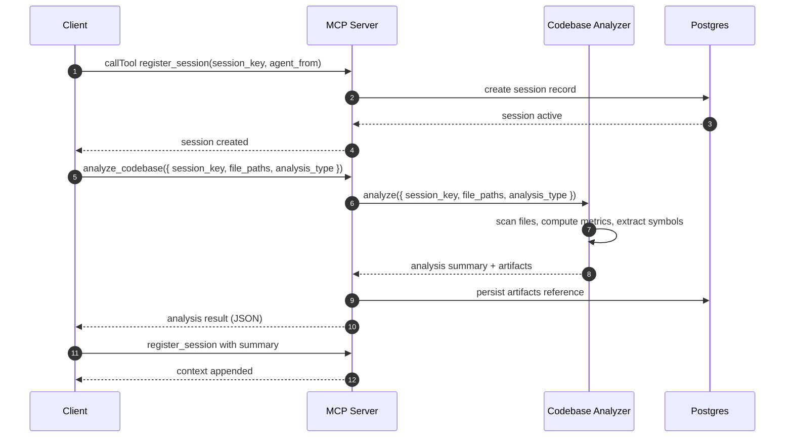

# Usage: Codebase Analysis

This guide describes how to leverage the optional codebase analysis capability to derive insights from a repository and feed them into sessions and handoffs. It integrates with the MCP server via tools and/or service APIs exposed internally.

Status
- Optional feature: enable only if codebase analysis is relevant for your use case.
- Backed by the Codebase Analyzer service and related specs in ./specs/mcp-context-handoff-core.

Related Code
- Service: [src/services/codebaseAnalyzer.ts](src/services/codebaseAnalyzer.ts)
- Supporting services: [src/services/contextManager.ts](src/services/contextManager.ts), [src/services/sessionManager.ts](src/services/sessionManager.ts)
- Metrics: [src/metrics/metricsCollection.ts](src/metrics/metricsCollection.ts)
- Error handling: [src/services/errorHandler.ts](src/services/errorHandler.ts)
- Requirements/Design: [specs/mcp-context-handoff-core/requirements.md](specs/mcp-context-handoff-core/requirements.md), [specs/mcp-context-handoff-core/design.md](specs/mcp-context-handoff-core/design.md), [specs/mcp-context-handoff-core/tasks.md](specs/mcp-context-handoff-core/tasks.md)

Typical Workflow
1) Register a session
2) Run analysis for a target path or repository
3) Persist useful findings as session context
4) Optionally request a handoff to another agent with the analysis summary

Mermaid Sequence


Parameters
- session_key (required, string)
- file_paths (required, array of strings)
- analysis_type (optional, enum: syntax, dependencies, structure, full)

Analysis Types
- syntax: Basic syntax checks and counts; highlights possible syntax issues and aggregates per-file stats.
- dependencies: Extracts module/file dependency information and aggregates edges for a dependency list/graph.
- structure: High-level structure overview (files, folders, symbols/classes/functions totals).
- full: Combines syntax, dependencies, and structure into a single comprehensive result.

Example: Running Analysis and Storing Findings
```ts
import { Client } from '@modelcontextprotocol/sdk/client/index.js';
import { StdioClientTransport } from '@modelcontextprotocol/sdk/client/stdio.js';

const transport = new StdioClientTransport({
  command: 'node',
  args: ['dist/server.js']
});
const client = new Client({ name: 'analysis-client', version: '1.0.0' }, { capabilities: {} });

await client.connect(transport);

// 1) Register session
const reg = await client.callTool({
  name: 'register_session',
  arguments: {
    session_key: 'session-' + Date.now(),
    agent_from: 'analysis-client',
    metadata: { repo: 'local', purpose: 'codebase-analysis' }
  }
});
const regPayload = JSON.parse(reg.content[0].text);
const session_key = regPayload.session?.session_key ?? regPayload.session_key ?? 'session-unknown';

// 2) Run codebase analysis (tool name may be exposed if enabled)
const analysis = await client.callTool({
  name: 'analyze_codebase',
  arguments: {
    session_key,
    file_paths: ['src/services/codebaseAnalyzer.ts', 'src/mcp/tools/index.ts'],
    analysis_type: 'full'
  }
});
const analysisPayload = JSON.parse(analysis.content[0].text);

// 3) Store summarized findings as session context (via update_context)
await client.callTool({
  name: 'update_context',
  arguments: {
    session_key,
    entries: [
      {
        type: 'message',
        content: `Analysis summary:\nFiles: ${analysisPayload.files}\nModules: ${analysisPayload.modules}\nHotspots: ${analysisPayload.hotspots?.join(', ') || 'none'}`
      }
    ]
  }
});
```

Response Format
- Success payload (generic shape)
```json
{
  "success": true,
  "message": "analysis completed",
  "summary": "Scanned 2 files; 1 module; no critical issues.",
  "findings": {
    "files": { "count": 2, "list": ["src/server.ts", "src/services/sessionManager.ts"] },
    "dependencies": { "totalEdges": 1, "list": [{"from": "src/server.ts", "to": "src/services/sessionManager.ts"}] },
    "structure": { "modules": 1, "symbols": { "functions": 5, "classes": 1 } }
  },
  "timestamp": "2025-08-02T12:00:00.000Z"
}
```

- Failure payload (example)
```json
{ "success": false, "message": "Path not found", "error_code": "validation_error", "details": { "file_paths": ["unknown/file.ts"] } }
```

Operational Notes
- Performance: Large repositories can be slow to scan; see ../performance.md for tuning (I/O concurrency, caching).
- Limits: Max file count, ignored patterns, and depth are configurable; see ../configuration.md.
- Caching: Results may be cached in Redis to accelerate repeated analysis runs.
- Persistence: Only summary/artifact references are stored by default; raw scans are ephemeral unless configured.

Security Considerations
- Path traversal protections are enforced in the analyzer module.
- Secrets-in-code scanning is disabled by default; enable only if appropriate and ensure proper handling of findings.
- Avoid exposing raw source content unless necessary; prefer metadata and summaries.

Troubleshooting
- Empty results: verify filePaths and sessionKey; check logs for ignored paths.
- Timeouts: reduce file set or use narrower analysisType; review metrics in ../performance.md.
- Memory pressure: limit filePaths per invocation.

Related
- Sessions: ./sessions.md
- Context: ./context.md
- Handoff: ./handoff.md
- API Reference: ../api-reference.md
- Configuration: ../configuration.md
- Performance: ../performance.md