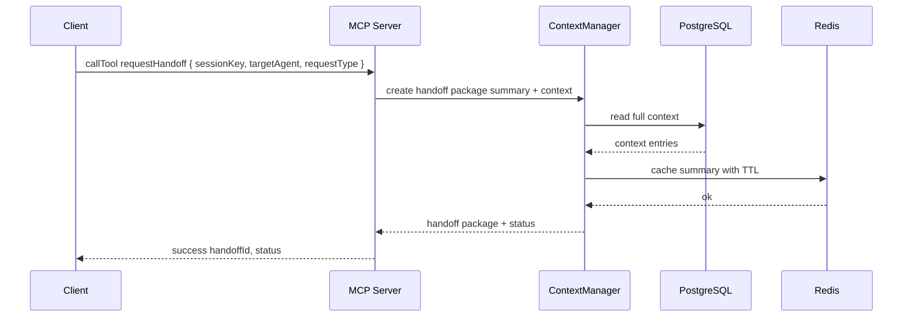

# Usage: Handoff

This guide explains how to request and manage handoffs between AI agents, including handoff types and expected responses.

Request Handoff requestHandoff
```ts
import { Client } from '@modelcontextprotocol/sdk/client/index.js';
import { StdioClientTransport } from '@modelcontextprotocol/sdk/client/stdio.js';

const transport = new StdioClientTransport({ command: 'node', args: ['dist/server.js'] });
const client = new Client({ name: 'docs-example', version: '1.0.0' }, { capabilities: {} });
await client.connect(transport);

const sessionKey = 'session-1722600000000';

const res = await client.callTool({
  name: 'requestHandoff',
  arguments: {
    sessionKey,
    targetAgent: 'downstream-assistant',
    requestType: 'context_transfer', // context_transfer | full_handoff | collaboration
    requestData: {
      instructions: 'Continue conversation, focus on implementation details',
      priority: 'normal'
    }
  }
});

const payload = JSON.parse(res.content[0].text);
console.log('Handoff:', payload);
```

Expected Response Shape
```json
{
  "success": true,
  "handoffId": "uuid",
  "status": "pending",
  "timestamp": "2025-08-02T12:06:00.000Z"
}
```

Handoff Types
- context_transfer: Provide summary and relevant context; source session remains active
- full_handoff: Provide full context and mark the session completed for the source agent
- collaboration: Share context with multiple agents while maintaining active state for the source

Sequence Diagram


Operational Notes
- Large sessions are summarized to keep payloads efficient
- For full_handoff, session status transitions to completed for the source agent
- Retries with exponential backoff are applied for transient failures
- Structured logging includes request correlation identifiers

Related
- Sessions: ./sessions.md
- Context: ./context.md
- API Reference: ../api-reference.md