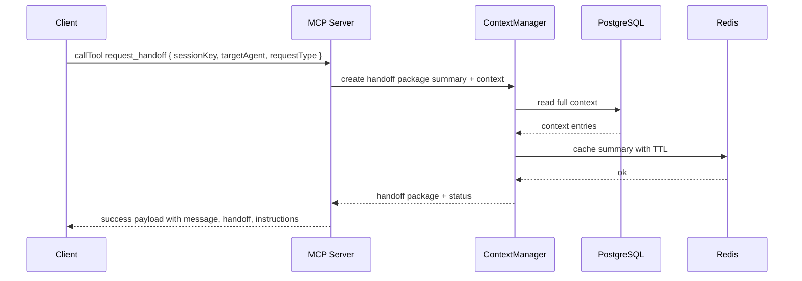

# Usage: Handoff

This guide explains how to request and manage handoffs between AI agents, including handoff types and expected responses.

Request Handoff request_handoff
```ts
import { Client } from '@modelcontextprotocol/sdk/client/index.js';
import { StdioClientTransport } from '@modelcontextprotocol/sdk/client/stdio.js';

const transport = new StdioClientTransport({ command: 'node', args: ['dist/server.js'] });
const client = new Client({ name: 'docs-example', version: '1.0.0' }, { capabilities: {} });
await client.connect(transport);

const sessionKey = 'session-1722600000000';

const res = await client.callTool({
  name: 'request_handoff',
  arguments: {
    sessionKey,
    targetAgent: 'downstream-assistant',
    requestType: 'context_transfer', // context_transfer | full_handoff | collaboration
    requestData: {
      instructions: 'Continue conversation, focus on implementation details',
      priority: 'normal'
    }
  }
});

const payload = JSON.parse(res.content[0].text);
console.log('Handoff:', payload);

// Example handling
if (payload.success) {
  const { handoff, instructions } = payload;
  // handoff fields shown below; use handoff.sessionKey to retrieve context
  // instructions.nextSteps may contain user-facing guidance
}
```

Expected Response Shape
```json
{
  "success": true,
  "message": "Handoff request processed successfully",
  "handoff": {
    "sessionKey": "session-1722600000000",
    "sourceAgent": "source-agent-id",
    "targetAgent": "downstream-assistant",
    "requestType": "context_transfer",
    "contextSummary": "string summary",
    "contextEntries": 42,
    "cacheKey": "handoff:downstream-assistant:session-1722600000000",
    "status": "active"
  },
  "instructions": {
    "message": "The context has been prepared for agent 'downstream-assistant'.",
    "nextSteps": [
      "The target agent can retrieve the context using sessionKey: session-1722600000000",
      "Context is cached and immediately available",
      "Full context history includes 42 entries",
      "Session remains active for continued collaboration"
    ]
  }
}
```

Handoff Types
- context_transfer: Provide summary and relevant context; source session remains active; response status is "active".
- full_handoff: Provide full context and mark the session completed for the source agent; response status is "completed".
- collaboration: Share context with multiple agents while maintaining active state for the source; response status remains "active".

Sequence Diagram


Operational Notes
- Large sessions are summarized to keep payloads efficient
- For full_handoff, session status transitions to completed for the source agent
- Retries with exponential backoff are applied for transient failures
- Structured logging includes request correlation identifiers

Related
- Sessions: ./sessions.md
- Context: ./context.md
- API Reference: ../api-reference.md