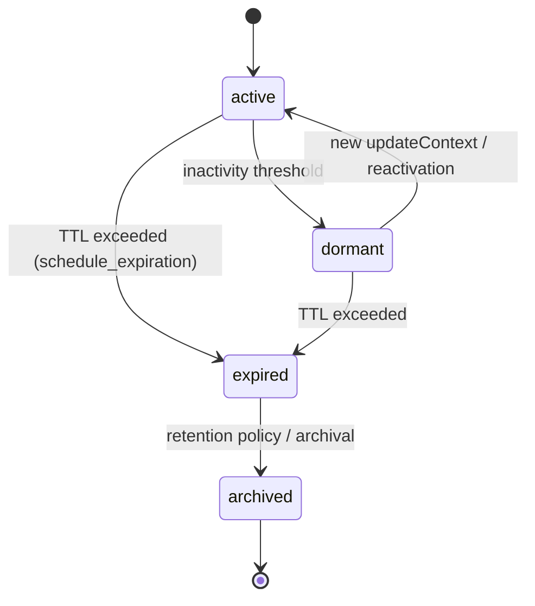

# Usage: Sessions

This guide covers registering sessions and understanding the session lifecycle.

Register a Session
```ts
import { Client } from '@modelcontextprotocol/sdk/client/index.js';
import { StdioClientTransport } from '@modelcontextprotocol/sdk/client/stdio.js';

const transport = new StdioClientTransport({ command: 'node', args: ['dist/server.js'] });
const client = new Client({ name: 'docs-example', version: '1.0.0' }, { capabilities: {} });
await client.connect(transport);

const res = await client.callTool({
  name: 'register_session',
  arguments: {
    sessionKey: 'session-' + Date.now(),
    agentFrom: 'docs-example',
    metadata: { purpose: 'session-demo' }
  }
});

// Tool responses are text-wrapped JSON per MCP SDK conventions
const payload = JSON.parse(res.content[0].text);
console.log('Session:', payload.session);
```

Expected Response
```json
{
  "success": true,
  "message": "Session registered successfully",
  "session": {
    "id": "uuid",
    "sessionKey": "session-1722600000000",
    "agentFrom": "docs-example",
    "status": "active",
    "createdAt": "2025-08-02T12:00:00.000Z",
    "metadata": {
      "purpose": "session-demo"
    }
  }
}
```

Lifecycle States
- active: session is active and accepts updates
- dormant: session marked dormant after inactivity threshold (flagged via isDormant=true)
- expired: status transitioned to expired when TTL elapses
- archived: session archived to cold storage; read-only access

Lifecycle Diagram


Operational Notes
- Duplicate registration returns a failure with existing session metadata
- Expiration is scheduled by the session manager and transitions status to "expired"
- A system context entry is appended upon registration for auditability

Related
- Context Updates: ./context.md
- Handoff Requests: ./handoff.md
- Resources: ./resources.md