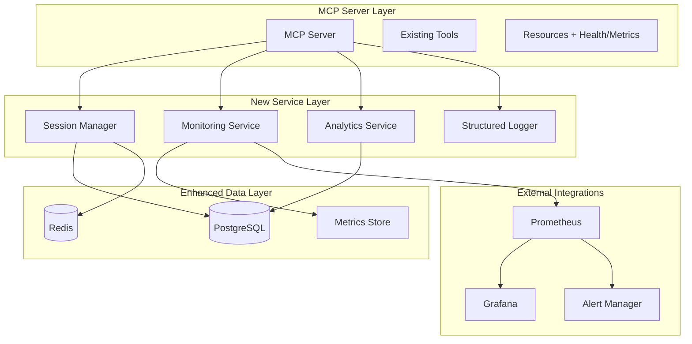

# Design Document

## Overview

This design enhances the existing AI Handoff MCP server with comprehensive session lifecycle management, monitoring capabilities, and operational insights. The enhancement builds upon the current architecture by adding new services, database tables, and monitoring endpoints while maintaining backward compatibility with existing MCP tools.

The design focuses on production readiness by implementing automated session management, structured logging, health monitoring, performance metrics, and analytics capabilities. All enhancements are designed to be non-intrusive to the existing functionality while providing significant operational value.

## Architecture

### High-Level Architecture Changes

The enhanced system maintains the existing MCP server architecture while adding new components:



### Component Integration

The new components integrate with existing services:
- **Session Manager**: Extends existing session operations with lifecycle management
- **Monitoring Service**: Wraps existing database and Redis operations with metrics collection
- **Analytics Service**: Analyzes existing session and context data
- **Structured Logger**: Enhances existing error handling with comprehensive logging

## Components and Interfaces

### 1. Session Manager Service

**Purpose**: Manages session lifecycle, expiration, and cleanup operations.

**Interface**:
```typescript
interface SessionManagerService {
  // Lifecycle management
  scheduleExpiration(sessionId: string, expiresAt: Date): Promise<void>;
  expireSession(sessionId: string): Promise<void>;
  archiveSession(sessionId: string): Promise<void>;
  cleanupOrphanedSessions(): Promise<number>;
  
  // Status management
  markSessionDormant(sessionId: string): Promise<void>;
  reactivateSession(sessionId: string): Promise<void>;
  
  // Configuration
  updateRetentionPolicy(policy: RetentionPolicy): Promise<void>;
}
```

**Key Features**:
- Automatic session expiration based on configurable timeouts
- Background cleanup of orphaned sessions
- Session archival to cold storage
- Dormant session management for cache optimization

### 2. Monitoring Service

**Purpose**: Provides comprehensive system monitoring, health checks, and metrics collection.

**Interface**:
```typescript
interface MonitoringService {
  // Health checks
  getSystemHealth(): Promise<HealthStatus>;
  checkDatabaseHealth(): Promise<ComponentHealth>;
  checkRedisHealth(): Promise<ComponentHealth>;
  
  // Metrics collection
  recordToolCall(toolName: string, duration: number, success: boolean): void;
  recordHandoffMetrics(sessionId: string, metrics: HandoffMetrics): void;
  recordPerformanceMetrics(operation: string, metrics: PerformanceMetrics): void;
  
  // Metrics export
  getPrometheusMetrics(): string;
  getSystemMetrics(): SystemMetrics;
}
```

**Key Features**:
- Real-time health monitoring of all system components
- Prometheus-compatible metrics export
- Performance tracking for all operations
- Automatic alerting on threshold breaches

### 3. Analytics Service

**Purpose**: Provides insights into session patterns, handoff effectiveness, and system usage.

**Interface**:
```typescript
interface AnalyticsService {
  // Session analytics
  getSessionStatistics(timeRange: TimeRange): Promise<SessionStats>;
  getHandoffSuccessRates(timeRange: TimeRange): Promise<HandoffStats>;
  getContextGrowthPatterns(timeRange: TimeRange): Promise<ContextStats>;
  
  // Performance analytics
  getPerformanceTrends(timeRange: TimeRange): Promise<PerformanceTrends>;
  getResourceUtilization(timeRange: TimeRange): Promise<ResourceStats>;
  
  // Insights
  detectAnomalies(): Promise<Anomaly[]>;
  generateRecommendations(): Promise<Recommendation[]>;
}
```

**Key Features**:
- Historical trend analysis
- Anomaly detection for unusual patterns
- Performance optimization recommendations
- Usage pattern insights

### 4. Structured Logger

**Purpose**: Provides comprehensive, structured logging for all system operations.

**Interface**:
```typescript
interface StructuredLogger {
  // Operation logging
  logToolCall(context: ToolCallContext): void;
  logHandoffEvent(context: HandoffContext): void;
  logSystemEvent(context: SystemContext): void;
  
  // Error logging
  logError(error: Error, context: ErrorContext): void;
  logWarning(message: string, context: WarningContext): void;
  
  // Performance logging
  logPerformanceMetric(metric: PerformanceMetric): void;
  logResourceUsage(usage: ResourceUsage): void;
}
```

**Key Features**:
- Structured JSON logging for easy parsing
- Contextual information for all log entries
- Performance and resource usage tracking
- Integration with log aggregation systems

## Data Models

### Enhanced Database Schema

**New Tables**:

```sql
-- Session lifecycle tracking
CREATE TABLE session_lifecycle (
  id UUID PRIMARY KEY DEFAULT gen_random_uuid(),
  session_id UUID NOT NULL REFERENCES sessions(id) ON DELETE CASCADE,
  event_type VARCHAR(50) NOT NULL, -- 'created', 'expired', 'archived', 'dormant'
  event_data JSONB DEFAULT '{}'::jsonb,
  created_at TIMESTAMP WITH TIME ZONE DEFAULT NOW()
);

-- System metrics storage
CREATE TABLE system_metrics (
  id UUID PRIMARY KEY DEFAULT gen_random_uuid(),
  metric_name VARCHAR(100) NOT NULL,
  metric_value DECIMAL NOT NULL,
  metric_type VARCHAR(50) NOT NULL, -- 'counter', 'gauge', 'histogram'
  labels JSONB DEFAULT '{}'::jsonb,
  recorded_at TIMESTAMP WITH TIME ZONE DEFAULT NOW()
);

-- Performance logs
CREATE TABLE performance_logs (
  id UUID PRIMARY KEY DEFAULT gen_random_uuid(),
  operation VARCHAR(100) NOT NULL,
  duration_ms INTEGER NOT NULL,
  success BOOLEAN NOT NULL,
  session_id UUID REFERENCES sessions(id),
  metadata JSONB DEFAULT '{}'::jsonb,
  created_at TIMESTAMP WITH TIME ZONE DEFAULT NOW()
);

-- Analytics aggregations
CREATE TABLE analytics_aggregations (
  id UUID PRIMARY KEY DEFAULT gen_random_uuid(),
  aggregation_type VARCHAR(50) NOT NULL,
  time_bucket TIMESTAMP WITH TIME ZONE NOT NULL,
  aggregation_data JSONB NOT NULL,
  created_at TIMESTAMP WITH TIME ZONE DEFAULT NOW()
);
```

**Enhanced Existing Tables**:

```sql
-- Add monitoring fields to sessions table
ALTER TABLE sessions ADD COLUMN last_activity_at TIMESTAMP WITH TIME ZONE DEFAULT NOW();
ALTER TABLE sessions ADD COLUMN is_dormant BOOLEAN DEFAULT FALSE;
ALTER TABLE sessions ADD COLUMN archived_at TIMESTAMP WITH TIME ZONE;
ALTER TABLE sessions ADD COLUMN retention_policy VARCHAR(50) DEFAULT 'standard';

-- Add performance tracking to context_history
ALTER TABLE context_history ADD COLUMN processing_time_ms INTEGER;
ALTER TABLE context_history ADD COLUMN content_size_bytes INTEGER;
```

### Configuration Models

```typescript
interface RetentionPolicy {
  name: string;
  activeSessionTtl: number; // hours
  archivedSessionTtl: number; // days
  logRetentionDays: number;
  metricsRetentionDays: number;
}

interface MonitoringConfig {
  healthCheckInterval: number; // seconds
  metricsCollectionInterval: number; // seconds
  alertThresholds: {
    responseTime: number; // ms
    errorRate: number; // percentage
    memoryUsage: number; // percentage
    diskUsage: number; // percentage
  };
}

interface AnalyticsConfig {
  aggregationInterval: number; // minutes
  anomalyDetectionSensitivity: number; // 0-1
  trendAnalysisWindow: number; // days
}
```

## Error Handling

### Enhanced Error Management

**Error Categories**:
1. **System Errors**: Database connectivity, Redis failures, resource exhaustion
2. **Session Errors**: Invalid sessions, expired sessions, permission issues
3. **Performance Errors**: Timeout errors, resource limit exceeded
4. **Data Errors**: Corruption, validation failures, consistency issues

**Error Handling Strategy**:

```typescript
interface ErrorHandler {
  // Categorized error handling
  handleSystemError(error: SystemError): Promise<ErrorResponse>;
  handleSessionError(error: SessionError): Promise<ErrorResponse>;
  handlePerformanceError(error: PerformanceError): Promise<ErrorResponse>;
  
  // Recovery mechanisms
  attemptRecovery(error: RecoverableError): Promise<boolean>;
  escalateError(error: CriticalError): Promise<void>;
  
  // Logging and alerting
  logError(error: Error, context: ErrorContext): void;
  triggerAlert(error: AlertableError): void;
}
```

**Recovery Mechanisms**:
- Automatic database reconnection with exponential backoff
- Redis failover to backup instances
- Session state recovery from persistent storage
- Graceful degradation when non-critical services fail

## Testing Strategy

### Testing Approach

**1. Unit Testing**:
- Individual service method testing
- Mock external dependencies (database, Redis)
- Test error conditions and edge cases
- Performance testing for critical paths

**2. Integration Testing**:
- End-to-end session lifecycle testing
- Database and Redis integration testing
- Monitoring and alerting integration testing
- MCP protocol compliance testing

**3. Performance Testing**:
- Load testing with concurrent sessions
- Memory usage and leak detection
- Database query performance testing
- Cache efficiency testing

**4. Monitoring Testing**:
- Health check endpoint testing
- Metrics accuracy validation
- Alert trigger testing
- Dashboard functionality testing

### Test Implementation

```typescript
// Example test structure
describe('SessionManagerService', () => {
  describe('Session Lifecycle', () => {
    it('should expire sessions after configured timeout');
    it('should archive expired sessions');
    it('should clean up orphaned sessions');
    it('should handle concurrent session operations');
  });
  
  describe('Performance', () => {
    it('should handle 1000 concurrent sessions');
    it('should maintain response times under 500ms');
    it('should not leak memory during long operations');
  });
});

describe('MonitoringService', () => {
  describe('Health Checks', () => {
    it('should detect database connectivity issues');
    it('should report system health accurately');
    it('should trigger alerts on threshold breaches');
  });
  
  describe('Metrics Collection', () => {
    it('should collect accurate performance metrics');
    it('should export Prometheus-compatible metrics');
    it('should handle high-frequency metric updates');
  });
});
```

### Monitoring Test Coverage

- Health endpoint response time and accuracy
- Metrics collection completeness and accuracy
- Alert trigger conditions and timing
- Dashboard data accuracy and refresh rates
- Log aggregation and searchability

The testing strategy ensures that all monitoring and session management features work reliably under various conditions and integrate seamlessly with the existing system.