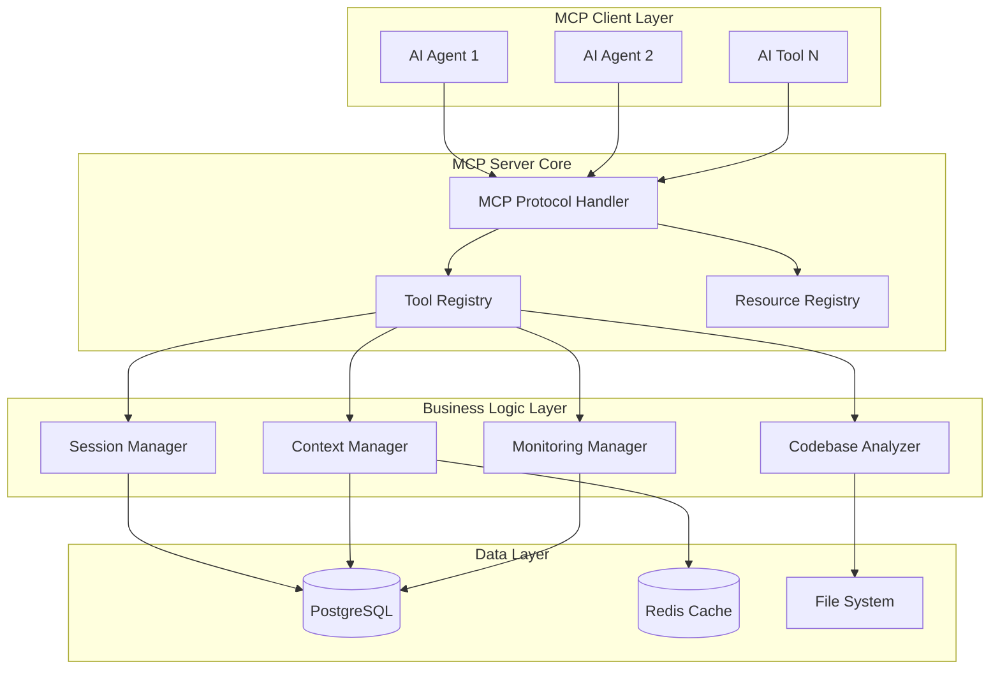

# Design Document

## Overview

The MCP Context Handoff Core system is designed as a production-ready Model Context Protocol (MCP) server that enables seamless context transfer between different AI tools and agents. The system provides a robust foundation for AI-to-AI handoffs with comprehensive session management, efficient context storage, and reliable protocol compliance.

The architecture follows a layered approach with clear separation of concerns: MCP protocol handling, business logic services, and data persistence. The system is built for reliability, performance, and extensibility while maintaining simplicity in the core handoff workflow.

## Architecture

### High-Level Architecture



### Component Architecture

The system is organized into distinct layers:

1. **MCP Protocol Layer**: Handles MCP-specific communication, tool registration, and resource management
2. **Service Layer**: Contains business logic for session management, context handling, and analysis
3. **Data Layer**: Manages persistence, caching, and file operations
4. **Monitoring Layer**: Provides observability, health checks, and performance tracking

## Components and Interfaces

### MCP Protocol Handler

**Purpose**: Manages MCP protocol compliance and client communication

**Key Responsibilities**:
- Tool and resource registration with proper schema validation
- Request/response handling with error management
- Protocol-compliant error codes and messaging
- Client connection lifecycle management

**Interface**:
```typescript
interface MCPProtocolHandler {
  registerTool(tool: MCPTool): void;
  registerResource(resource: MCPResource): void;
  handleToolCall(request: CallToolRequest): Promise<CallToolResponse>;
  handleResourceRead(request: ReadResourceRequest): Promise<ReadResourceResponse>;
  validateSchema(data: any, schema: JSONSchema): boolean;
}
```

### Session Manager Service

**Purpose**: Manages session lifecycle, expiration, and state transitions

**Key Responsibilities**:
- Session creation and registration with unique identifiers
- Lifecycle management (active → dormant → expired → archived)
- Automatic cleanup and retention policy enforcement
- Session reactivation and state recovery

**Interface**:
```typescript
interface SessionManagerService {
  createSession(sessionKey: string, agentFrom: string, metadata?: any): Promise<Session>;
  getSession(sessionKey: string): Promise<Session | null>;
  updateSessionActivity(sessionId: string): Promise<void>;
  expireSession(sessionId: string): Promise<void>;
  archiveSession(sessionId: string): Promise<void>;
  reactivateSession(sessionId: string): Promise<void>;
  cleanupExpiredSessions(): Promise<number>;
}
```

### Context Manager Service

**Purpose**: Handles context storage, retrieval, and summarization

**Key Responsibilities**:
- Context entry storage with proper sequencing
- Full context retrieval with efficient pagination
- Context summarization for handoff preparation
- Context type categorization and metadata management

**Interface**:
```typescript
interface ContextManagerService {
  addContext(sessionId: string, type: ContextType, content: string, metadata?: any): Promise<ContextEntry>;
  getFullContext(sessionKey: string): Promise<FullContext | null>;
  createHandoffSummary(sessionKey: string): Promise<ContextSummary>;
  getContextByType(sessionId: string, type: ContextType): Promise<ContextEntry[]>;
}
```

### Codebase Analyzer Service

**Purpose**: Analyzes code files and extracts relevant context for handoffs

**Key Responsibilities**:
- File content analysis with configurable depth
- Dependency extraction and structure mapping
- Code snippet extraction and relevance scoring
- Integration with session context for automatic storage

**Interface**:
```typescript
interface CodebaseAnalyzerService {
  analyzeFiles(sessionKey: string, filePaths: string[], analysisType: AnalysisType): Promise<AnalysisResult>;
  extractDependencies(filePath: string): Promise<string[]>;
  extractStructure(filePath: string): Promise<CodeStructure>;
  generateCodeSummary(filePath: string): Promise<string>;
}
```

### Database Manager

**Purpose**: Provides data persistence with connection pooling and transaction management

**Key Responsibilities**:
- Connection pool management with automatic reconnection
- Transaction handling with rollback support
- Query optimization and prepared statement caching
- Data integrity enforcement and constraint validation

**Interface**:
```typescript
interface DatabaseManager {
  query<T>(sql: string, params?: any[]): Promise<QueryResult<T>>;
  transaction<T>(callback: (client: PoolClient) => Promise<T>): Promise<T>;
  getSession(sessionKey: string): Promise<Session | null>;
  createSession(sessionKey: string, agentFrom: string, metadata: any): Promise<Session>;
  addContextEntry(sessionId: string, type: string, content: string, metadata: any): Promise<ContextEntry>;
  getContextHistory(sessionId: string): Promise<ContextEntry[]>;
}
```

### Cache Manager

**Purpose**: Provides high-performance caching with intelligent eviction

**Key Responsibilities**:
- Session data caching with TTL management
- Context caching for frequently accessed sessions
- Cache invalidation on data updates
- Performance metrics and hit rate tracking

**Interface**:
```typescript
interface CacheManager {
  get<T>(key: string): Promise<T | null>;
  set<T>(key: string, value: T, ttl?: number): Promise<void>;
  delete(key: string): Promise<void>;
  invalidatePattern(pattern: string): Promise<void>;
  getStats(): Promise<CacheStats>;
}
```

## Data Models

### Session Model

```typescript
interface Session {
  id: string;                    // UUID primary key
  sessionKey: string;            // Unique session identifier
  agentFrom: string;             // Source agent identifier
  agentTo?: string;              // Target agent identifier
  status: SessionStatus;         // Current session status
  createdAt: Date;               // Creation timestamp
  updatedAt: Date;               // Last update timestamp
  expiresAt?: Date;              // Expiration timestamp
  lastActivityAt: Date;          // Last activity timestamp
  isDormant: boolean;            // Dormant state flag
  archivedAt?: Date;             // Archive timestamp
  retentionPolicy: string;       // Retention policy name
  metadata: Record<string, any>; // Additional metadata
}

type SessionStatus = 'active' | 'completed' | 'expired' | 'cancelled';
```

### Context Entry Model

```typescript
interface ContextEntry {
  id: string;                    // UUID primary key
  sessionId: string;             // Foreign key to session
  sequenceNumber: number;        // Sequence within session
  contextType: ContextType;      // Type of context
  content: string;               // Context content
  metadata: Record<string, any>; // Context metadata
  createdAt: Date;               // Creation timestamp
  processingTimeMs?: number;     // Processing time metrics
  contentSizeBytes?: number;     // Content size metrics
}

type ContextType = 'message' | 'file' | 'tool_call' | 'system';
```

### Handoff Package Model

```typescript
interface HandoffPackage {
  sessionKey: string;            // Session identifier
  sourceAgent: string;           // Source agent
  targetAgent: string;           // Target agent
  requestType: HandoffType;      // Type of handoff
  handoffSummary: ContextSummary; // Generated summary
  fullContext: FullContext;      // Complete context
  requestData: Record<string, any>; // Additional data
  timestamp: string;             // ISO timestamp
  cacheKey: string;              // Cache storage key
}

type HandoffType = 'context_transfer' | 'full_handoff' | 'collaboration';
```

## Error Handling

### Error Classification

The system implements a comprehensive error handling strategy with clear error classification:

1. **Protocol Errors**: MCP-specific errors with standard error codes
2. **Validation Errors**: Input validation and schema compliance errors
3. **Business Logic Errors**: Session state and workflow errors
4. **System Errors**: Database, cache, and infrastructure errors
5. **Recovery Errors**: Error recovery and fallback mechanism errors

### Error Response Format

```typescript
interface ErrorResponse {
  success: false;
  error: string;                 // Human-readable error message
  errorCode: string;             // Machine-readable error code
  details?: Record<string, any>; // Additional error details
  timestamp: string;             // ISO timestamp
  requestId?: string;            // Request correlation ID
}
```

### Error Recovery Strategy

- **Graceful Degradation**: System continues operating with reduced functionality
- **Automatic Retry**: Transient errors trigger automatic retry with exponential backoff
- **Circuit Breaker**: Prevents cascade failures by temporarily disabling failing components
- **Fallback Mechanisms**: Alternative code paths for critical operations
- **Error Logging**: Comprehensive error logging with context and stack traces

## Testing Strategy

### Unit Testing

**Scope**: Individual components and services
**Framework**: Jest with TypeScript support
**Coverage Target**: 90% code coverage for core business logic

**Test Categories**:
- Service method testing with mocked dependencies
- Data model validation and transformation
- Error handling and edge cases
- Cache behavior and TTL management

### Integration Testing

**Scope**: Component interactions and data flow
**Framework**: Jest with test database and Redis instance
**Coverage**: End-to-end workflows and cross-service communication

**Test Categories**:
- MCP protocol compliance testing
- Database transaction integrity
- Cache consistency and invalidation
- Session lifecycle state transitions

### Performance Testing

**Scope**: System performance under load
**Framework**: Custom performance test suite
**Metrics**: Response time, throughput, resource utilization

**Test Categories**:
- Concurrent session handling
- Large context processing
- Database query performance
- Cache hit rate optimization

### MCP Compliance Testing

**Scope**: Protocol adherence and client compatibility
**Framework**: MCP SDK test utilities
**Coverage**: Tool registration, resource access, error handling

**Test Categories**:
- Schema validation compliance
- Error code correctness
- Resource URI handling
- Tool parameter validation

## Performance Considerations

### Database Optimization

- **Connection Pooling**: Configurable pool size with connection reuse
- **Query Optimization**: Prepared statements and query plan caching
- **Indexing Strategy**: Optimized indexes for common query patterns
- **Partitioning**: Time-based partitioning for large tables

### Caching Strategy

- **Multi-Level Caching**: Application-level and Redis caching
- **Cache Warming**: Proactive cache population for frequently accessed data
- **Intelligent Eviction**: LRU eviction with usage pattern analysis
- **Cache Coherence**: Consistent cache invalidation on data updates

### Memory Management

- **Object Pooling**: Reuse of expensive objects and connections
- **Garbage Collection**: Optimized GC settings for low-latency operation
- **Memory Monitoring**: Automatic memory usage tracking and alerting
- **Resource Cleanup**: Proper resource disposal and leak prevention

### Scalability Design

- **Horizontal Scaling**: Stateless design enabling multiple server instances
- **Load Balancing**: Session affinity with consistent hashing
- **Database Sharding**: Partition strategy for large-scale deployments
- **Async Processing**: Non-blocking operations with event-driven architecture

## Security Considerations

### Input Validation

- **Schema Validation**: Strict JSON schema validation for all inputs
- **Content Sanitization**: XSS and injection attack prevention
- **Size Limits**: Configurable limits on content and metadata size
- **Type Safety**: TypeScript type checking and runtime validation

### Access Control

- **Session Isolation**: Strict session boundary enforcement
- **Agent Authentication**: Optional agent identity verification
- **Resource Protection**: Access control for sensitive resources
- **Audit Logging**: Comprehensive access and modification logging

### Data Protection

- **Encryption at Rest**: Optional database encryption for sensitive data
- **Encryption in Transit**: TLS encryption for all network communication
- **Data Anonymization**: PII scrubbing in logs and metrics
- **Retention Compliance**: Configurable data retention and deletion policies

## Monitoring and Observability

### Health Monitoring

- **Component Health**: Individual service health checks
- **Dependency Health**: Database and cache connectivity monitoring
- **Resource Monitoring**: CPU, memory, and disk usage tracking
- **Performance Metrics**: Response time and throughput monitoring

### Logging Strategy

- **Structured Logging**: JSON-formatted logs with consistent schema
- **Contextual Logging**: Request correlation and session tracking
- **Log Levels**: Configurable log levels with appropriate filtering
- **Log Aggregation**: Centralized logging with search and analysis

### Metrics Collection

- **Business Metrics**: Session creation, handoff success rates, context volume
- **Technical Metrics**: Database performance, cache hit rates, error rates
- **Custom Metrics**: Application-specific metrics and KPIs
- **Alerting**: Threshold-based alerting for critical metrics

### Distributed Tracing

- **Request Tracing**: End-to-end request flow tracking
- **Performance Profiling**: Detailed timing and bottleneck identification
- **Error Correlation**: Error tracking across service boundaries
- **Dependency Mapping**: Service dependency visualization and analysis